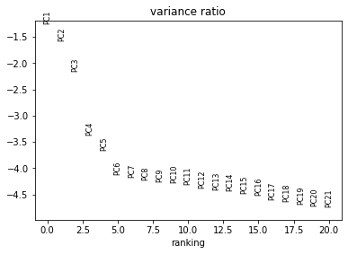
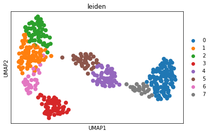
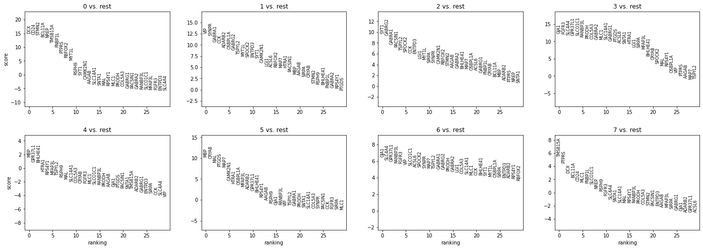
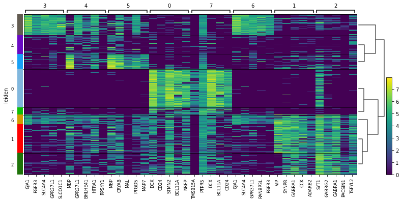
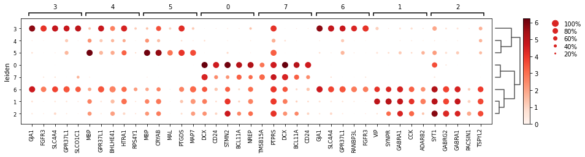
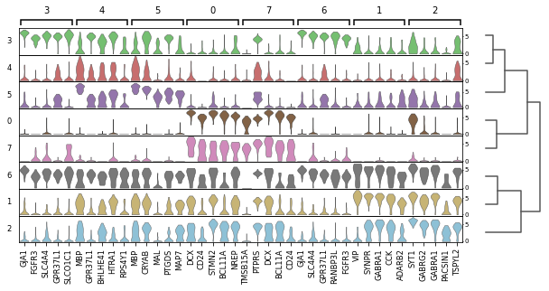
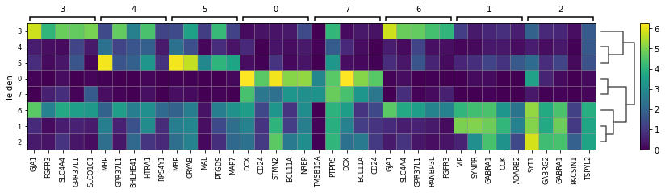
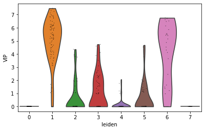
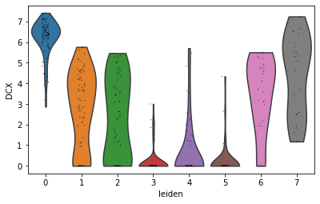

# Introduction to sc-REnF (Darmanis Data)
An Entropy Based Feature Selection- Application on Single cell RNA Sequence Data

# Summary


A novel and Robust Entropy based Feature (gene) Selection method for large Single-cell RNA-seq data, using  Renyi ´and Tsallis entropy. The SC-REnF is also demonstrated for identifying marker genes from different cell types. Our results shed some light on the single-cell clustering problem with the application of entropy based feature selection, and therefore, it will be an important tool to complement existing methods in the scRNA-seq analysis pipeline. Results are shown here in brief.


# How to use sc-REnF

## Data Loading and Preprocessing


Load the Libraries

```
library(SingleCellExperiment)
library(edgeR)
library(scDatasets)
library(biomaRt)
library('Linnorm')
```

We will give the method demonstration on Darmanis Dataset. For more details about the data, see [A survey of human brain transcriptome diversity at the single cell level](https://www.pnas.org/content/112/23/7285#:~:text=Our%20results%20show%20that%20MHCI,as%20endothelial%20cells%20and%20microglia.)

Read the gene expression data using (SingleCellExperiment object), calculate CPM values and extract metadata.


```
rawdata <- readRDS("darmanis.rds")
data <- assay(rawdata)
```
For demonstration purposes, we apply a standard *Linnorm* normalization with minimum read count =5 in 10 percent cell. However any other normalization approach may be used.
Gene should be in row, Cells should be in coloumn


```
preprocessedata= normalized_data(data)

```

```
dim(preprocessedata) 
[1] 8994    466

preprocessedata[1:2,1:3]
      Brain    Brain    Brain
A2M  0.000000 4.953487 4.908761
AAAS 1.526881 0.000000 0.000000
```

A total of 466 cells and 8994 genes are remaining in the dataset after cell, gene filtering, and Normalization.


## Feature (Gene Selection)

Load the libraries

```
library(foreach)
library(doParallel)
```
Apply the feature (gene) selection using Renyi and Tsallis with preprocesse data and cell types. Default--- Core Number (p=20), q-values (q=0.7,0.3) , Number of genes to be selected (nf=500) 

```
RenyiFeadata=Renyifeaturedata(data,cell,gene,p,q,nf)
TsallisFeadata=Tsallisfeaturedata(data,cell,gene,p,q,nf)

```

The  Reduced Darmanis data using Renyi entropy

```
dim(RenyiFeadata)
[1] 466  500
RenyiFeadata[1:2,1:3]
              BRD7P3 MEX3A TMSB15A
astrocytes  2.749929     0       0
endothelial 0.000000     0       0
```

The  Reduced Darmanis data using Tsallis entropy

```
dim(TsallisFeadata)
[1] 466  500
TsallisFeadata[1:2,1:3]
              PCP4     DDX5      A2M
astrocytes     0 4.095699 0.000000
endothelial    0 5.816251 4.955909
```
## Saving the results

```
write.csv(TsallisFeadata, file="Tsallisd.csv")
write.csv(RenyiFeadata, file="Renyid.csv.csv")
```

## Clustering using selected feature

import libraries in python and importing the data

```
import numpy as np
import pandas as pd
import scanpy as sc
adata1=sc.read_csv('Renyid.csv', delimiter=',', first_column_names=None, dtype='float32')
```

Using PCA dimensionality reduction and Leiden clustering

```
sc.tl.pca(adata1, svd_solver='arpack')
sc.pl.pca_variance_ratio(adata1,n_pcs=20,log=True)
```



```
#create neighborhood graph using 10 pcs 
sc.pp.neighbors(adata1, n_neighbors=15, n_pcs=30)
##dim reduction using umap
sc.tl.umap(adata1)
#Leiden clustering
import leidenalg
sc.tl.leiden(adata1)
##visualizing clusters
sc.pl.umap(adata1, color=['leiden'])
```


save the clustering results

```
pd.DataFrame(adata1.obs).to_csv("darmanis_leiden.csv")
```


## Marker selection form identified clusters

Compute a ranking for the highly differential genes in each cluster using Wilcoxon-RankSum test

```
sc.tl.rank_genes_groups(adata1, 'leiden', method='wilcoxon',key_added = "wilcoxon")
sc.pl.rank_genes_groups(adata1, n_genes=30, sharey=False,key="wilcoxon")
```



Top 10 DE genes for each cluster using Wilcox-Ranksum Test

```
#save top 10 DE genes for each cluster using wilcox-ranksum test
result = adata1.uns['wilcoxon']
groups = result['names'].dtype.names
p=pd.DataFrame(
    {group + '_' + key[:1]: result[key][group]
    for group in groups for key in ['names', 'pvals']}).head(10)
pd.DataFrame(p).to_csv("darmanis_marker.csv")
```
Visualizing top 5 DE genes for each cluster in a heatmap using wilcox results

```
sc.pl.rank_genes_groups_heatmap(adata1, n_genes=5, key="wilcoxon", groupby="leiden", show_gene_labels=True)
```


Visualizing top 5 DE genes for each cluster in a dotplot using t-test results. Here color of dot represents mean expression of the gene in those cell, dot size represents fraction of cells expressing a gene  

```
sc.pl.rank_genes_groups_dotplot(adata1, n_genes=5, key="wilcoxon", groupby="leiden")
```


Visualizing top 5 DE genes for each cluster in a stacked violin plot using t-test results 

```
sc.pl.rank_genes_groups_stacked_violin(adata1, n_genes=5, key="wilcoxon", groupby="leiden")
```


Visualizing top 5 DE genes for each cluster in a matrixplot using wilcox results. matrixplot represents mean expression of a gene in a cluster as a heatmap.

```
sc.pl.rank_genes_groups_matrixplot(adata1, n_genes=5, key="wilcoxon", groupby="leiden")
```


Showing expression of some marker genes (e.g VIP,DCX) across Leiden groups

```
sc.pl.violin(adata1, ['VIP'], groupby='leiden')
```


```
sc.pl.violin(adata1, ['DCX'], groupby='leiden')
```



